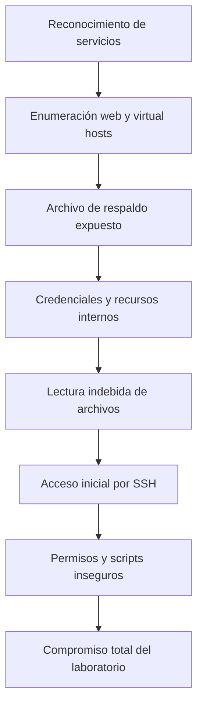

# Evaluación de seguridad: TryHackMe Team

Caso práctico realizado durante el Programa de Especialización en Ciberseguridad de Nebrija Formación Profesional.

> Este proyecto documenta una evaluación efectuada exclusivamente en un laboratorio autorizado de TryHackMe. Las direcciones, credenciales, claves, flags y respuestas específicas del reto han sido omitidas o anonimizadas deliberadamente.

## Resumen

El objetivo del laboratorio fue evaluar una máquina Linux expuesta en una red controlada, identificar debilidades de configuración y demostrar su impacto mediante una cadena de ataque completa. El trabajo abarcó reconocimiento, enumeración web, análisis de archivos expuestos, acceso inicial, enumeración local y escalada de privilegios.

El resultado principal fue comprobar cómo varias vulnerabilidades de gravedad diferente podían encadenarse hasta provocar el compromiso total del sistema.

## Objetivos

- Identificar servicios y aplicaciones accesibles.
- Enumerar directorios, archivos y hosts virtuales.
- Analizar posibles filtraciones de información y credenciales.
- Conseguir acceso inicial de forma controlada.
- Revisar permisos, scripts y configuraciones de `sudo`.
- Documentar el impacto y proponer medidas correctivas.

## Herramientas utilizadas

| Herramienta | Uso |
|---|---|
| Kali Linux | Entorno de análisis |
| Nmap | Descubrimiento y enumeración de servicios |
| Gobuster | Enumeración de directorios y archivos |
| Wfuzz | Descubrimiento de hosts virtuales |
| Firefox y herramientas del navegador | Inspección de la aplicación web |
| FTP y SSH | Validación controlada de accesos |
| Utilidades Linux | Análisis de archivos, permisos y procesos |

## Metodología

El análisis siguió una adaptación práctica de las fases habituales de una prueba de penetración:

1. **Reconocimiento:** identificación de puertos, servicios y tecnologías.
2. **Enumeración:** búsqueda de contenido web, archivos de respaldo y hosts virtuales.
3. **Análisis de vulnerabilidades:** relación entre la información expuesta y posibles vías de acceso.
4. **Acceso inicial:** validación de una vía de entrada dentro del entorno autorizado.
5. **Postexplotación:** revisión de usuarios, permisos y configuraciones locales.
6. **Escalada de privilegios:** demostración del impacto de scripts y permisos inseguros.
7. **Informe:** clasificación de hallazgos y propuesta de mitigaciones.

La metodología detallada se encuentra en [methodology.md](./methodology.md).

## Cadena de ataque resumida

## Hallazgos principales

| ID | Hallazgo | Severidad orientativa | Impacto |
|---|---|---:|---|
| THM-01 | Información interna en el código fuente | Baja | Facilita el descubrimiento de activos |
| THM-02 | Archivo de respaldo accesible públicamente | Alta | Expone lógica interna y datos sensibles |
| THM-03 | Credenciales almacenadas en un script | Alta | Permite acceso no autorizado a servicios |
| THM-04 | Lectura arbitraria de archivos locales | Crítica | Expone configuración, usuarios y secretos |
| THM-05 | Material de autenticación SSH expuesto | Crítica | Posibilita la suplantación de una cuenta |
| THM-06 | Configuración insegura de `sudo` | Alta | Permite ejecutar acciones con otro usuario |
| THM-07 | Script privilegiado modificable | Crítica | Permite escalar hasta administrador |

Consulta el análisis y las mitigaciones en [findings.md](./findings.md).

## Resultado y aprendizaje

El laboratorio me permitió practicar una cadena de ataque completa y comprender que una vulnerabilidad aparentemente menor puede convertirse en crítica cuando se combina con otros fallos. También reforcé la importancia de:

- Documentar evidencias de manera ordenada.
- Formular hipótesis antes de ejecutar nuevas pruebas.
- Aplicar el principio de mínimo privilegio.
- Proteger secretos y claves fuera del código.
- Revisar permisos, propietarios y tareas automatizadas.
- Traducir los resultados técnicos en riesgos y acciones correctivas.

## Evidencias y divulgación responsable

Las capturas originales forman parte de la memoria académica. En la versión pública no se incluyen flags, contraseñas, claves privadas, direcciones del objetivo ni una reproducción paso a paso de las respuestas. En [evidence/README.md](./evidence/README.md) se explica el criterio aplicado.

## Alcance ético

Todas las pruebas se realizaron sobre una máquina de laboratorio proporcionada expresamente para formación. Las técnicas descritas solo deben utilizarse en sistemas propios o con autorización previa y verificable.

